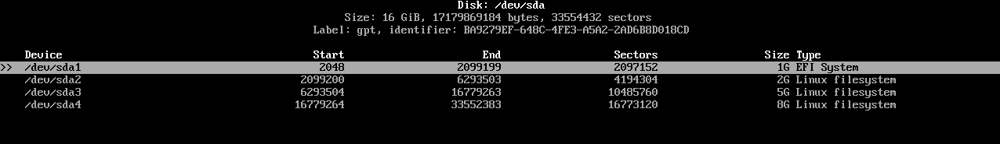
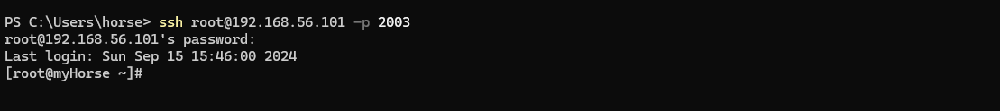

## Установка Arch Linux

1. Образ Arch Linux (.iso) https://mirror.yandex.ru/archlinux/iso/2024.09.01/
2. Установка VirtualBox
    + Создание машины
      + Тип: Linux
      + Версия: Arch Linux (64-bit)
      + RAM: 2048 MB
      + VHD (динамический): 16 GB
3. Разметка диска `cfdisk`
4. Форматирование разделов
   + mkfs.fat –F32 /dev/sda1 (загрузка системы, EFI)
   + mkswap /dev/sda2 (файл подкачки, SWAP)
   + mkfs.ext4 /dev/sda3 (Домашняя папка /home)
   + mkfs.ext4 /dev/sda4 (Корневой раздел)
5. Монтирование разделов `mount`
    

6. Установка пакетов (базовые утилиты)
    + `pacstrap /mnt base base-devel linux linux-firmware linux-headers sudo nano networkmanager efibootmgr`
7. Генерация fstab (конфигурационный файл для дисков и разделов)   
    + `genfstab –U –p />>/mnt/etc/fstab`
8. Вход в систему
    + `arch-chroot /mnt /bin/bash`
9. Создание имени компьютера (my_name)
    + echo my_name > /etc/hostname
    + Редактируем /etc/hosts: `nano /etc/hosts`
    + Добавляем: **127.0.1.1 localhost.localdomain my_name**
10. Включение сетевого менеджера
    + `systemctl enable NetworkManager`
11. Добавление пользователя (my_user)
    + `useradd –m –g users –G wheel –s /bin/bash my_user`
    + `passwd my_user`
12. Добавление прав sudo для группы wheel (пользователя)
    + `EDITOR=nano visudo`
    + **wheel ALL=(ALL:ALL) ALL**
13. Установка пакета GRUB (загрузчик системы), cоздание конфига GRUB
    + `pacman –S grub`
    + `grub-install --target=x86_64-efi --bootloader-id=GRUB --efi-directory=/boot/efi --removable`
    + grub-mkconfig –o /boot/grub/grub.cfg
14. Создание пароля для root
    + `passwd`
15. Перезапуск системы
    + `exit`
    + `reboot`

## Подключение к серверу

1. IP для подключения к серверу
    + На сервере: `ip addr show`
2. Подключение к серверу
    + На клиенте: `ssh username@server_ip -p PORT`
   

