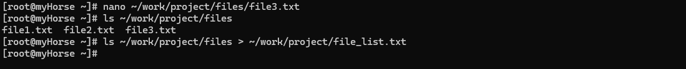
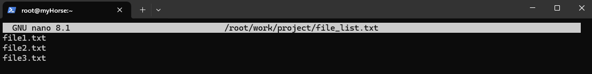

## Работа с файловой системой

### `mkdir` — команда для создания нового каталога (папки).

Синтаксис: `mkdir [опции] имя_каталога`

```bash
mkdir my_folder # создаст новый каталог с именем 'my_folder' в текущей рабочей директории;
mkdir -p my_directory/sub_dir # создаст каталог 'my_directory' а также подкаталог 'sub_dir' внутри него.
```

Флаги:
+ `-p` позволяет создавать родительские каталоги, если они не существуют.

### `touch` — команда, которая создаёт новый файл или изменяет время последнего доступа и модификации файла.

Синтаксис: `touch [опции] имя_файла`

```bash
touch file.txt # создаст пустой файл с именем 'file.txt'.
```
Атрибуты: команда touch может использоваться для изменения времени 
последнего доступа и времени последней модификации файла. 
По умолчанию она устанавливает текущее время как время последней 
модификации.

Флаги:
+ `-a` — изменяет только время последнего доступа;
+ `-m` — изменяет только время последней модификации;
+ `-c` — не изменяет время файла, если он уже существует.

### `ls` — команда выводит список файлов и каталогов в текущей рабочей директории.

Синтаксис: `ls [опции]`

```bash
ls # выведет список всех файлов и каталогов в текущем каталоге.
```

Опции:
+ `-l` — отображает подробную информацию о файлах и каталогах, включая права доступа, владельца, размер и т. д.;
+ `-h` — показывает размеры файлов в удобном для чтения формате (например, '10K' вместо '10240');
+ `-r` — сортирует вывод в обратном порядке;
+ `-t` — сортирует файлы по времени модификации (сначала самые новые);
+ `-X` — сортирует по расширению имени файла (в алфавитном порядке).

### `cp` — команда копирует файлы. Можно скопировать один или несколько файлов в другое место.

Синтаксис: `cp [опции] исходный_файл целевой_файл`

```bash
cp file1.txt file2.txt # скопирует файл 'file1.txt' в файл 'file2.txt';
cp *.txt new_folder/ # скопирует все файлы с расширением '.txt' в каталог 'new_folder'.
```

Флаги:
+ `-r` — рекурсивно копировать каталоги;
+ `-u` — копировать только если исходный файл новее целевого файла или если целевой файл не существует;
+ `-p` — сохранять время модификации и права доступа при копировании.

### `mv` — команда перемещает файлы или переименовывает их.

Синтаксис: `mv [опции] источник_назначение`

```bash
mv file.txt new_directory/ # переместит файл 'file.txt' в каталог 'new_directory'.
```

Атрибуты: команда `mv` может использоваться для перемещения файлов 
между каталогами или для переименования файлов.

Флаги:
+ `-i` — запрашивать подтверждение перед перезаписью существующего файла;
+ `-f` — игнорировать несуществующие файлы и никогда не запрашивать подтверждения.


## Создание директорий и файлов

```bash
mkdir -p ~/work/project/files
```
```bash
touch ~/work/project/files/file1.txt
echo "текст" > ~/work/project/files/file2.txt
nano ~/work/project/files/file3.txt
```
```bash
ls ~/work/project/files > ~/work/project/file_list.txt
```



