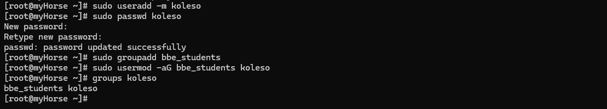

## Управление пользователями и правами доступа

### Создание пользователя:

Для создания нового пользователя в системе можно 
использовать команды `adduser` или `useradd`.

+ Создание пользователя с домашней директорией:
    ```bash
    sudo useradd -m имя_пользователя
    ```
  Флаг `-m` создаёт домашний каталог (/home/имя_пользователя).

+ Установка пароля для пользователя:
    ```bash
    sudo passwd имя_пользователя
    ```

### Создание группы:
Чтобы создать новую группу в системе, используем команду `groupadd`.

+ Создание группы:
    ```bash
    sudo groupadd имя_группы
    ```

### Добавление пользователя в группу:

Команда `usermod`, чтобы добавить пользователя в группу.

+ Добавить пользователя в группу:
    ```bash
    sudo usermod -aG имя_группы имя_пользователя
    ```
  Флаг -aG добавляет пользователя в группу без удаления его из других групп.

### Изменение прав доступа к файлам и директориям:

+ Изменение прав доступа с помощью `chmod`:
Команда `chmod` изменяет права доступа для владельца, группы и остальных пользователей. 
  + Синтаксис:
    ```bash
    chmod [options] режим файл_или_каталог
    ```
  + Пример: Разрешить владельцу и группе читать, писать и выполнять файл, а остальным пользователям — не иметь доступа:

    ```bash
    sudo chmod 770 каталог
    ```
    
  + Основные числа прав:
    + `7` — полный доступ (чтение, запись, выполнение).
    + `6` — чтение и запись.
    + `5` — чтение и выполнение.
    + `4` — только чтение.
    + `0` — нет доступа.
  + флаг (g+s) заставляет новые файлы и папки наследовать группу 
владельца родительского каталога.


### Изменение владельца и группы файлов/директорий:
+ Изменение владельца файла или директории (`chown`):
  Команда `chown` изменяет владельца и/или группу для указанного файла или каталога.

  + Пример: Сделать пользователя `koleso` владельцем и группу `bbe_students` группой для директории:

    ```bash
    sudo chown koleso:bbe_students каталог
    ```

  + Рекурсивное изменение владельца для всех файлов и подкаталогов (флаг `-R`):

    ```bash
    sudo chown -R koleso:bbe_students каталог
    ```


## Пример

```bash
sudo useradd -m koleso # Создание пользователя
sudo passwd koleso # Установка пароля для пользователя
sudo groupadd bbe_students # Создание группы bbe_stuidents
sudo usermod -aG bbe_students koleso # и добавление в нее пользователя koleso
groups koleso # Проверка
```


```bash
# Настройка прав доступа на каталог ~/work/project
mkdir -p ~/work/project
sudo chown -R :bbe_students ~/work/project # Меняем группу владельца каталога
sudo chmod -R 770 ~/work/project # Настройка права доступа
sudo chmod g+s ~/work/project # Наследование прав доступа для новых файлов
```
